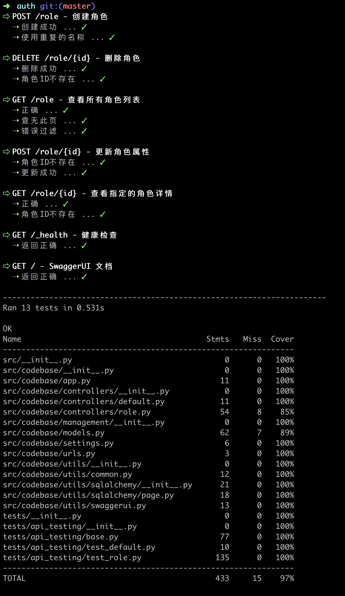

# tornado.boot

Start a service-oriented project rapidly


## 简介

`tornado.boot` 项目创建一个快速启动（微）服务开发的模版。

使用如下技术堆栈 [Dependency graph](https://github.com/ooclab/authz/network/dependencies) ：

- [pyeva](https://github.com/ooclab/eva)
- [tornado](https://github.com/tornadoweb/tornado)
- [sqlalchemy](https://github.com/zzzeek/sqlalchemy)


## 使用

### 创建项目副本

```
git clone https://github.com/ooclab/tornado.boot.git
mv tornado.boot YOUR_PROJECT_NAME
cd YOUR_PROJECT_NAME
vim .git/config
# 设置 `remote "origin"` 为你自己的 git 仓库地址
# 启动开发
```

### 开发

启动服务：

```
python3 src/server.py
```

运行管理工具：

```
# 查看工具帮助
python3 src/manage.py
# 同步数据库
python3 src/manage.py syncdb -d
# 清空数据库
python3 src/manage.py dropdb -d --ignore-env-check
```

### Docker

可以运行 docker-compose 启动开发环境：

```
docker-compose up -d --build
docker-compose exec api bash
```

进入容器内部，操作同上

### 运行测试用例

```
nose2 -v --with-coverage
```

### 运行代码风格检查

```
pylint src tests
flake8
```

### 代码覆盖率

运行测试，并生成覆盖率测试：

```
nose2 -v --with-coverage
```



生成 html 报告，使用浏览器查看：

```
nose2 -v --with-coverage --coverage-report html
open htmlcov/index.html
```
